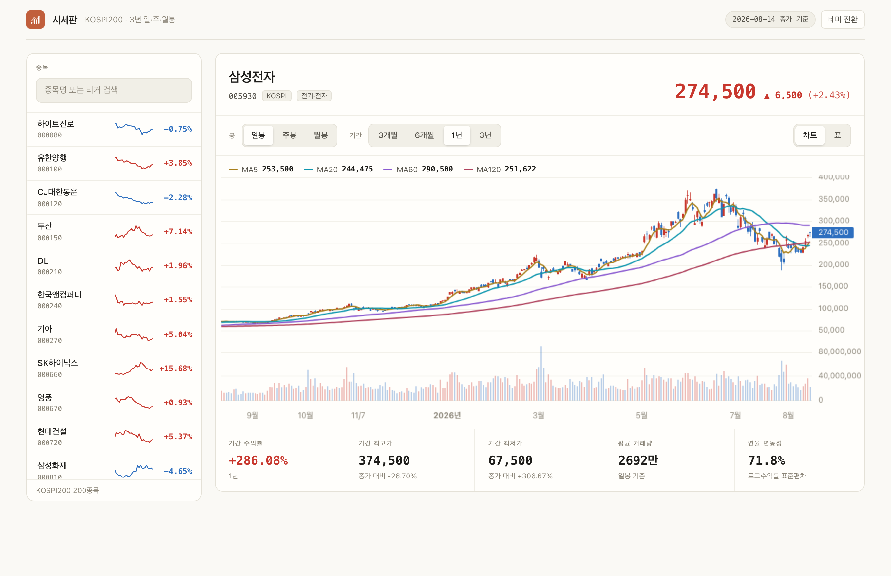
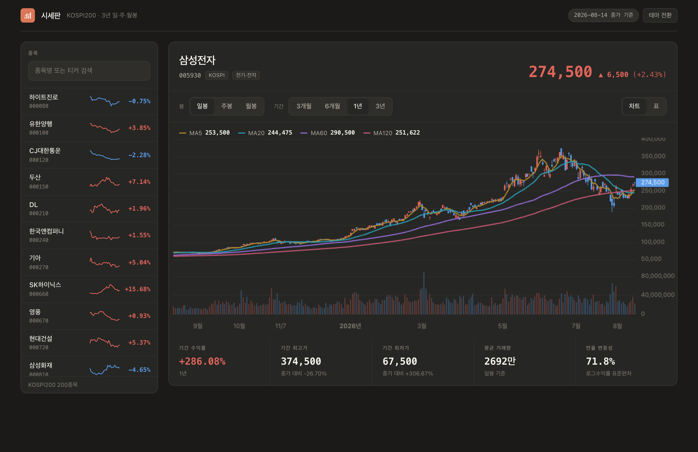
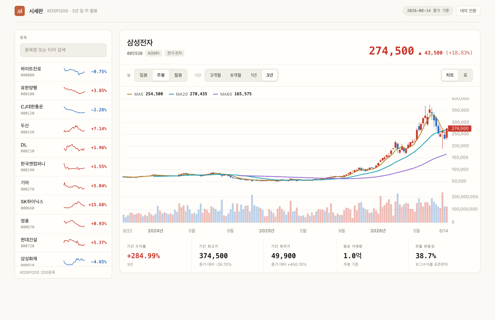

# krx-stock-charts

> 🇰🇷 [한국어 README](README_KO.md) · 🔗 **[Live demo](https://krx-stock-charts.vercel.app)**

Three years of daily, weekly, and monthly candlestick data for **every KOSPI and KOSDAQ listing**,
collected from the Korea Exchange and served through a Next.js dashboard.

The collection pipeline pulls daily bars from KRX, pre-computes the weekly and
monthly series, and stores all three in Supabase. The web layer reads them back
and draws the charts. The two halves never call each other — they meet only at
the database schema.

## Status

| Milestone | Scope | State |
|---|---|---|
| M0 | Scaffold, ticker universe | ✅ Done |
| M1 | Three-year backfill, resampling | ✅ Done |
| M2 | Daily incremental update, GitHub Actions | ✅ Done |
| M3 | Frontend foundation, Supabase read layer | ✅ Done |
| M4 | Candlestick charts (lightweight-charts) | ✅ Done |
| M5 | Deployment, security review | ✅ Done |

Currently stored: **2,412,261 rows** across **2,763 tickers** (KOSPI 942 + KOSDAQ 1,821) —
1,905,612 daily, 409,898 weekly, 96,751 monthly, spanning 2023-08-14 to 2026-08-14 (267 MB).

## Screenshots



Daily candles with volume and four moving averages. The ticker rail on the left
carries a sparkline and the latest change for each of the 200 constituents.

| Dark theme | Weekly bars, three-year range |
|---|---|
|  |  |

Switching the timeframe changes the moving-average set too — daily uses 5/20/60/120,
weekly drops to 5/20/60, and monthly to 3/12, because a 120-period average on
monthly bars would span ten years.

## Features

- **Three-year backfill** of all 2,763 listings, using adjusted prices so
  splits and rights issues don't distort the chart.
- **Pre-computed weekly and monthly bars.** The resampling lives in one place
  (Python), so there is no second implementation to drift out of sync.
- **Daily incremental update** on a weekday schedule. It costs a single KRX
  request because it slices the ticker × trading-day grid along the date axis
  rather than the ticker axis.
- **Idempotent writes.** The primary key is `(ticker, timeframe, date)`, so
  re-running the pipeline overwrites rather than duplicates.
- **Validation in two layers** — a Python pass that reports which ticker and
  date is wrong, and `CHECK` constraints in Postgres that reject bad rows
  outright.
- **Read-only web access.** The browser uses the anon key; row-level security
  blocks every write path — verified against the live database, not assumed.
- **Turnover as well as volume.** The bottom pane switches between the two; turnover
  is comparable across price levels, which raw share count is not.
- **Market cap kept current.** The daily update also stores 시가총액 and 상장주식수 per
  ticker (one extra pykrx call for the whole market), with the basis date alongside —
  today's value only, no historical series. `krx-signal-briefing` reads it for the
  market-cap line in its briefing mail.
- **Charts that stay readable.** Volume sits in its own pane, moving averages are
  drawn from a warmup-extended series so lines start at the first visible bar, and
  arrow keys walk the bars for keyboard users.

## Tech stack

| Layer | Tools |
|---|---|
| Collection | Python 3.11, pykrx, pandas |
| Storage | Supabase (PostgreSQL), tables prefixed `ksc_` |
| Automation | GitHub Actions (weekdays, 18:00 KST) |
| Web | Next.js 16, TypeScript, Tailwind CSS, lightweight-charts |
| Tests | pytest (129), Vitest (93) |

## Setup

### 1. Pipeline

```bash
python -m venv venv
source venv/bin/activate          # Windows: venv\Scripts\activate
pip install -r requirements-dev.txt
cp .env.example .env              # then fill in the values
```

`.env` needs four values:

| Key | Purpose |
|---|---|
| `KRX_ID`, `KRX_PW` | pykrx 1.2.8+ requires a KRX account for ticker-list queries. OHLCV queries work without one. |
| `SUPABASE_URL`, `SUPABASE_SERVICE_KEY` | Pipeline writes. The service key bypasses RLS — never ship it to the browser. |

### 2. Database

Run `supabase/schema.sql` in the Supabase SQL editor. It is idempotent, so
re-running it is safe.

### 3. Web

```bash
cd web
npm install
cp .env.local.example .env.local  # NEXT_PUBLIC_SUPABASE_URL + ANON key
npm run dev
```

## Usage

```bash
python -m pipeline.main --universe                 # refresh the ticker list
python -m pipeline.main --backfill                 # three-year backfill (~3 min)
python -m pipeline.main --backfill --limit 5       # trial run on a few tickers
python -m pipeline.main --update                   # today's incremental update
                                                   #   (bars + market cap, 2 KRX calls)
python -m pipeline.main --update --date 20260814   # a specific trading day
```

The GitHub Actions workflow runs `--universe` followed by `--update` on
weekdays. It needs `KRX_ID`, `KRX_PW`, `SUPABASE_URL`, and
`SUPABASE_SERVICE_KEY` as repository secrets.

## Tests

```bash
# Pipeline
ruff check . && mypy pipeline/ && pytest tests/ -v

# Web
cd web && npm run lint && npm test && npm run build
```

## Structure

```
pipeline/
  krx_client.py   pykrx wrapper — the only module that touches the network
  universe.py     KOSPI 200 constituent list
  collect.py      fetch → validate → resample → store
  resample.py     daily → weekly/monthly (pure functions)
  validate.py     integrity checks that name the offending ticker and date
  store.py        Supabase upserts (idempotent)
  update.py       incremental update, adjusted-price drift detection
supabase/
  schema.sql      tables, indexes, RLS policies
web/
  lib/types.ts    shared contract, mirrors pipeline/models.py
  lib/load.ts     Supabase queries, including moving-average warmup
  lib/paginate.ts works around the 1000-row response cap
  lib/chart.ts    bar → chart-series transforms, theme token reads
  components/     TickerRail, CandleChart, QuoteHeader, StatTiles, DataTable
docs/
  SPEC.md PLAN.md DESIGN.md TASKS.md
  mockups/        interactive design mockup and architecture explainer
```

## Notes from building this

Three things the real data forced, recorded here because they are easy to get
wrong a second time.

**Tickers are not numbers.** `0126Z0` (Samsung Epis Holdings) is a real KOSPI
200 constituent. Validating with `^\d{6}$` silently dropped it.

**Trading halts arrive as zeros.** KRX reports open, high, and low as 0 on a
halted day while carrying the previous close. Those become flat bars rather
than gaps.

**Adjusted prices round inconsistently.** Applying the adjustment factor can
leave the high one won below the close even though the raw values were equal.
Across three years and 200 tickers the discrepancy was *always* exactly one
won, so the repair tolerance is set to one won — anything larger is not
rounding and is left for validation to catch.

## Disclaimer

Built for personal study and analysis. Not investment advice, and not real-time
data — quotes go up to the previous trading day's close.

## License

MIT
